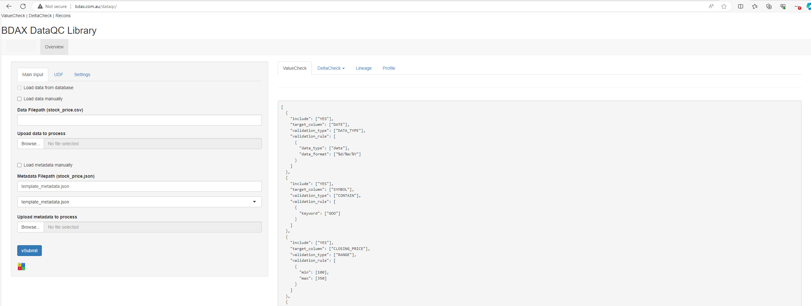
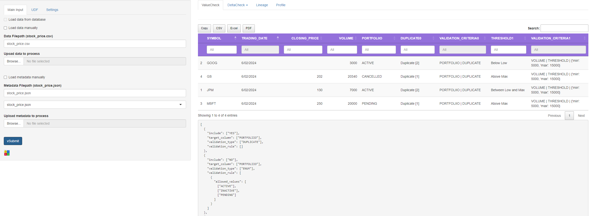
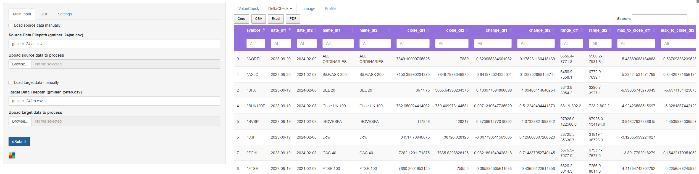
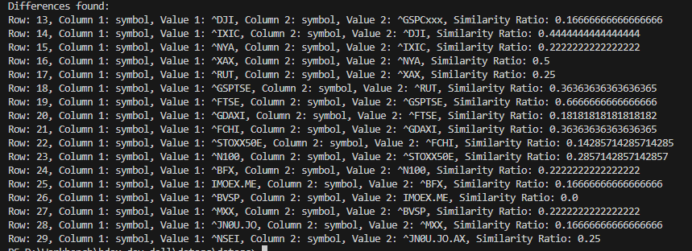

# DataQC - Ensured Data Quality Check Library

<!-- TOC -->
* [DataQC - Ensured Data Quality Check Library](#dataqc---ensured-data-quality-check-library)
  * [Executive Summary](#executive-summary)
  * [Introduction: Key Objectives](#introduction-key-objectives)
    * [Checkpoint 1: Value Check (VCheck)](#checkpoint-1-value-check-vcheck)
    * [Checkpoint 2: Delta Check (DCheck)](#checkpoint-2-delta-check-dcheck)
    * [Checkpoint 3: Vertical and Horizontal Reconciliation (VRecon, HRecon)](#checkpoint-3-vertical-and-horizontal-reconciliation-vrecon-hrecon)
  * [Key Capabilities and Benefits](#key-capabilities-and-benefits)
  * [Get started:](#get-started)
  * [Project philosophy](#project-philosophy)
  * [1. ValueCheck](#1-valuecheck)
    * [Basic](#basic)
    * [Validation Type: RANGE](#validation-type-range)
    * [Validation Type: THRESHOLD](#validation-type-threshold)
    * [Validation Type: TIER](#validation-type-tier)
    * [Validation Type:  LENGTH](#validation-type-length)
    * [Validation Type: ENUM](#validation-type-enum)
    * [Validation Type: DATA_TYPE](#validation-type-datatype)
    * [Validation Type: CONTAIN](#validation-type-contain)
    * [Validation Type: PATTERN](#validation-type-pattern)
    * [Validation Type: CATEGORY](#validation-type-category)
    * [Validation Type: EMAIL](#validation-type-email)
    * [Validation Type: UNIQUE](#validation-type-unique)
    * [Validation Type: UDF](#validation-type-udf)
  * [2. DeltaCheck](#2-deltacheck)
    * [DeltaCheck()](#deltacheck)
    * [ColumnMatcher()](#columnmatcher)
  * [3. VRecon and Lineage](#3-vrecon-and-lineage-)
  * [4. Usage: DProfile()](#4-usage-dprofile)
  * [Deployments Options](#deployments-options)
  * [Considerations](#considerations)
<!-- TOC -->


## Executive Summary
The DataQC library provides data practitioners and business users with a suite of tools to ensure the accuracy and consistency of their data. These tools enable users to reconcile, analyze, and validate their data, ultimately leading to confident decision-making across projects and departments.



## Introduction: Key Objectives
"Is it okay to go live?: When preparing to send data to the real world, it is crucial to ensure its quality and reliability. This report outlines the essential checkpoints to verify data integrity before its release.

### Checkpoint 1: Value Check (VCheck)
"Are the values in the dataset valid and reliable?": The first checkpoint involves validating the values within the data records. The DataQC library offers the "Value Check" feature, which allows users to apply specific validation rules to ensure data meets all requirements. This feature also helps identify and address any outliers within the data.

### Checkpoint 2: Delta Check (DCheck)
"What's the delta between current and previous datasets?": The second checkpoint focuses on capturing the differences between current and previous datasets. The DataQC library includes the "Delta Check" feature, which compares data points and identifies any changes that fall outside of the normal distribution and standard deviation. This enables users to identify discrepancies in the data effectively.

### Checkpoint 3: Vertical and Horizontal Reconciliation (VRecon, HRecon)
"What's the statistical breakdown and what's the trend from historical viewpoint?": The third checkpoint involves conducting macro-level analysis of the data. The DataQC library provides the "Vertical Reconciliation" (VRecon) and "Horizontal Reconciliation" (HRecon) features. These features enable users to analyze data trends, identify inconsistencies within datasets, and uncover potential anomalies. This, in turn, allows for informed decision-making based on historical data trends.


## Key Capabilities and Benefits
The DataQC library provides key capabilities that empower users to validate specific data points, reconcile data from different sources, analyze data trends, and gain comprehensive insights into data quality. <br> 
The benefits of using the DataQC library include improved data quality, increased efficiency through automation, and stronger business impact through optimized operations, increased revenue, and risk mitigation.


## 1. ValueCheck
VCheck enable to check the value in the specific column using **vcheck()** in **dataqc** library: <br>



### Basic
```commandline
python dataqc.py --function='vcheck'  --data='data_source' --metadata='/input/metadata_source.json'

# Sample: CSV
valueCheck = ValueCheck(data_filepath="stock_price.csv", metadata_filepath="stock_price.json", data_source_type="csv")
print (valueCheck.run())

# Sample: SQL:
valueCheck = ValueCheck(sql_stmt="select * from stock_prices", connection_string="ODBC:connection_string", metadata_filepath="golf_cc_address.json", data_source_type="sql")
# valueCheck.get_data_from_database(sql_stmt='select * from stock_prices')
print (valueCheck.run())
```

#### Input Data: stock_price.csv 
```
SYMBOL,TRADING_DATE,CLOSING_PRICE,VOLUME,PORTFOLIIO
JPM,6/02/2024,130,7000,ACTIVE
GOOG,6/02/2024,,3000,ACTIVE
MSFT,6/02/2024,250,20000,PENDING
GS,6/02/2024,202,20340,CANCELLED
```

#### Input Metadata: stock_price.json 
```
[  
  {
    "include": "YES",
    "target_column": "CLOSING_PRICE",
    "validation_type": "RANGE",
    "validation_rule": [
      {
        "low": 150,
        "max": 250
      }]
  }]
```


### Validation Type: RANGE
This validation type checks if the values in the target column ("CLOSING_PRICE" ) falls within the specified range (low: 150 and max: 250) .
```
[  
  {
    "target_column": "CLOSING_PRICE",
    "validation_type": "RANGE",
    "validation_rule": [
      {
        "low": 150,
        "max": 250
      }]
  }]
```

#### Output: output.csv
```
SYMBOL,TRADING_DATE,CLOSING_PRICE,VOLUME,PORTFOLIIO,RANGE0,VALIDATION_CRITERIA0
JPM,6/02/2024,130.0,7000,ACTIVE,Out of range,"CLOSING_PRICE | RANGE | {'low': 150, 'max': 250}"
GOOG,6/02/2024,,3000,ACTIVE,Validation type [RANGE] is not supported.,"[""CLOSING_PRICE | RANGE | {'low': 150, 'max': 250}""]"
MSFT,6/02/2024,250.0,20000,PENDING,Within Range,"[""CLOSING_PRICE | RANGE | {'low': 150, 'max': 250}""]"
GS,6/02/2024,202.0,20340,CANCELLED,Within Range,"[""CLOSING_PRICE | RANGE | {'low': 150, 'max': 250}""]"
```

### Validation Type: THRESHOLD
This validation type checks if the values in a target column falls within the specified threshold range.
```
{
    "target_column": "VOLUME",
    "validation_type": "THRESHOLD",
    "validation_rule": [
      {
        "low": 5000,
        "max": 15000
      }]
 }
```

#### Output
```
SYMBOL,TRADING_DATE,CLOSING_PRICE,VOLUME,PORTFOLIIO,THRESHOLD0,VALIDATION_CRITERIA0
JPM,6/02/2024,130.0,7000,ACTIVE,Between Low and Max,"VOLUME | THRESHOLD | {'low': 5000, 'max': 15000}"
GOOG,6/02/2024,,3000,ACTIVE,Below Low,"[""VOLUME | THRESHOLD | {'low': 5000, 'max': 15000}""]"
MSFT,6/02/2024,250.0,20000,PENDING,Above Max,"[""VOLUME | THRESHOLD | {'low': 5000, 'max': 15000}""]"
GS,6/02/2024,202.0,20340,CANCELLED,Above Max,"[""VOLUME | THRESHOLD | {'low': 5000, 'max': 15000}""]"
```
### Validation Type: TIER
This validation type checks if the values in a target column fall within the specified tiered ranges.
```
{
  "target_column": "PREDICTION",
  "validation_type": "TIER",
  "validation_rule": [
    {
      "tier_0": 10,
      "tier_1": 20,
      "tier_2": 30,
      "tier_3": 40,
      "tier_4": 60,
      "tier_5": 60,
      "tier_6": 70,
      "tier_7": 80,
      "tier_8": 90,
      "tier_9": 100
    }]
}
```
#### Output
```
DATE,SYMBOL,NAME,CLOSE,CHANGE,RANGE,CLOSE_TO_MAX,CLOSE_TO_MIN,VOLUME,ADJUSTED,PREDICTION,MA_SIGNAL,MA_SIGNAL_GOLDEN_CROSS,RSI_SIGNAL,RSI,MA_10,MA_60,MA_100,MA_200,DIST_60,DIST_100,DIST_200,MARKET_CAP,DURATION,PROCESSED_TIME,TIER0,VALIDATION_CRITERIA0
27/01/2022,LYC.AX,Lynas Rare EARTHS Ltd,8.99,-3.020496224, 4.8-11.2,2.25,-4.21,6445664,8.99,59.08836094,Neutral,GX10,RSI_Down,10.08370267,10.508,9.248833333,8.3419,7.21345,-2.798551169,7.769213249,24.62829853,x57946519.36,2021-01-27-2022-01-27,20220100000000.0,Tier4,"PREDICTION | TIER | {'tier_0': 10, 'tier_1': 20, 'tier_2': 30, 'tier_3': 40, 'tier_4': 60, 'tier_5': 60, 'tier_6': 70, 'tier_7': 80, 'tier_8': 90, 'tier_9': 100}"
27/01/2022,PLS.AX,TBD,3.135,-3.538461538,0.9-3.9,0.725,-2.205,30815191,3.135,45.20416332,Bullish,GX10,RSI_Down,18.9480449,3.5985,2.84325,2.5449,2.0537,10.26114482,23.18755157,52.65131227,y96605623.79,2021-01-27-2022-01-27,20220100000000.0,Tier4,"[""PREDICTION | TIER | {'tier_0': 10, 'tier_1': 20, 'tier_2': 30, 'tier_3': 40, 'tier_4': 60, 'tier_5': 60, 'tier_6': 70, 'tier_7': 80, 'tier_8': 90, 'tier_9': 100}""]"
27/01/2022,TLX.AX,Telix Pharmaceuticals Limited,6.48,-2.114803625,3.6-8.7,2.19,-2.92,1258011,6.48,60.87154952,Neutral,GX10,RSI_Down,9.941097085,7.858,7.424333333,6.9175,6.0323,-12.71943609,-6.324539212,7.421713111,8151911.28,2021-01-27-2022-01-27,20220100000000.0,Tier6,"[""PREDICTION | TIER | {'tier_0': 10, 'tier_1': 20, 'tier_2': 30, 'tier_3': 40, 'tier_4': 60, 'tier_5': 60, 'tier_6': 70, 'tier_7': 80, 'tier_8': 90, 'tier_9': 100}""]"
27/01/2022,VESG.AX,Vanguard Investments Australia Ltd,71.5,-1.106504795,60.8-79.3,7.769997,-10.68,14419,71.5,32.55256386,Neutral,GX10,RSI_Down,6.994863344,74.471,77.16733323,75.87129999,72.97645016,-7.344212889,-5.761467104,-2.02318714,1030958.5,2021-01-27-2022-01-27,20220100000000.0,Tier3,"[""PREDICTION | TIER | {'tier_0': 10, 'tier_1': 20, 'tier_2': 30, 'tier_3': 40, 'tier_4': 60, 'tier_5': 60, 'tier_6': 70, 'tier_7': 80, 'tier_8': 90, 'tier_9': 100}""]"
27/01/2022,WOW.AX,TBD,33.889999,-1.511191514,33.9-43.5,9.650002,0.0,2396357,33.889999,26.34801178,Bearish,Neutral,RSI_Down,16.34611505,35.0330002,38.37600022,38.85760014,39.41148143,-11.68960077,-12.78411719,-14.00983222,81212536.33,2021-01-27-2022-01-27,20220100000000.0,Tier2,"[""PREDICTION | TIER | {'tier_0': 10, 'tier_1': 20, 'tier_2': 30, 'tier_3': 40, 'tier_4': 60, 'tier_5': 60, 'tier_6': 70, 'tier_7': 80, 'tier_8': 90, 'tier_9': 100}""]"
```

### Validation Type:  LENGTH
This validation type can be used to validate the length of a target column. It can ensure that the values meet a specific length requirement.
```
{
  "target_column": "NAME",
  "validation_type": "LENGTH",
  "validation_rule": [
    {
      "min": 15,
      "max": 25
    }]
}
```

#### Output
```
DATE,SYMBOL,NAME,CLOSE,CHANGE,RANGE,CLOSE_TO_MAX,CLOSE_TO_MIN,VOLUME,ADJUSTED,PREDICTION,MA_SIGNAL,MA_SIGNAL_GOLDEN_CROSS,RSI_SIGNAL,RSI,MA_10,MA_60,MA_100,MA_200,DIST_60,DIST_100,DIST_200,MARKET_CAP,DURATION,PROCESSED_TIME,LENGTH0,VALIDATION_CRITERIA0
27/01/2022,LYC.AX,Lynas Rare EARTHS Ltd,8.99,-3.020496224, 4.8-11.2,2.25,-4.21,6445664,8.99,59.08836094,Neutral,GX10,RSI_Down,10.08370267,10.508,9.248833333,8.3419,7.21345,-2.798551169,7.769213249,24.62829853,x57946519.36,2021-01-27-2022-01-27,20220100000000.0,Within Length,"NAME | LENGTH | {'min': 15, 'max': 25}"
27/01/2022,PLS.AX,TBD,3.135,-3.538461538,0.9-3.9,0.725,-2.205,30815191,3.135,45.20416332,Bullish,GX10,RSI_Down,18.9480449,3.5985,2.84325,2.5449,2.0537,10.26114482,23.18755157,52.65131227,y96605623.79,2021-01-27-2022-01-27,20220100000000.0,Out of Length,"[""NAME | LENGTH | {'min': 15, 'max': 25}""]"
27/01/2022,TLX.AX,Telix Pharmaceuticals Limited,6.48,-2.114803625,3.6-8.7,2.19,-2.92,1258011,6.48,60.87154952,Neutral,GX10,RSI_Down,9.941097085,7.858,7.424333333,6.9175,6.0323,-12.71943609,-6.324539212,7.421713111,8151911.28,2021-01-27-2022-01-27,20220100000000.0,Out of Length,"[""NAME | LENGTH | {'min': 15, 'max': 25}""]"
27/01/2022,VESG.AX,Vanguard Investments Australia Ltd,71.5,-1.106504795,60.8-79.3,7.769997,-10.68,14419,71.5,32.55256386,Neutral,GX10,RSI_Down,6.994863344,74.471,77.16733323,75.87129999,72.97645016,-7.344212889,-5.761467104,-2.02318714,1030958.5,2021-01-27-2022-01-27,20220100000000.0,Out of Length,"[""NAME | LENGTH | {'min': 15, 'max': 25}""]"
27/01/2022,WOW.AX,TBD,33.889999,-1.511191514,33.9-43.5,9.650002,0.0,2396357,33.889999,26.34801178,Bearish,Neutral,RSI_Down,16.34611505,35.0330002,38.37600022,38.85760014,39.41148143,-11.68960077,-12.78411719,-14.00983222,81212536.33,2021-01-27-2022-01-27,20220100000000.0,Out of Length,"[""NAME | LENGTH | {'min': 15, 'max': 25}""]"
```


### Validation Type: ENUM
This validation type (PORTFOLIIO) can be used to check if the values in the target column are within a predefined list ["ACTIVE", "INACTIVE", "PENDING"]. <br>
It can ensure that the values are only selected from a specified set of choices.
```
{
    "target_column": "PORTFOLIIO",
    "validation_type": "ENUM",
    "validation_rule": [
      {
        "allowed_values": ["ACTIVE", "INACTIVE", "PENDING"]
      }
    ]
  }
```

#### Output
```
SYMBOL,TRADING_DATE,CLOSING_PRICE,VOLUME,PORTFOLIIO,ENUM0,VALIDATION_CRITERIA0
JPM,6/02/2024,130.0,7000,ACTIVE,Within allowed_values,"PORTFOLIIO | ENUM | {'allowed_values': ['ACTIVE', 'INACTIVE', 'PENDING']}"
GOOG,6/02/2024,,3000,ACTIVE,Within allowed_values,"[""PORTFOLIIO | ENUM | {'allowed_values': ['ACTIVE', 'INACTIVE', 'PENDING']}""]"
MSFT,6/02/2024,250.0,20000,PENDING,Within allowed_values,"[""PORTFOLIIO | ENUM | {'allowed_values': ['ACTIVE', 'INACTIVE', 'PENDING']}""]"
GS,6/02/2024,202.0,20340,CANCELLED,Out of allowed_values,"[""PORTFOLIIO | ENUM | {'allowed_values': ['ACTIVE', 'INACTIVE', 'PENDING']}""]"
```

### Validation Type: DATA_TYPE
This validation type ensures that the data in a target column (TRADING_DATE) is of the specified data type ('date') and format ('%d/%m/%Y').
```
{
    "target_column": "TRADING_DATE",
    "validation_type": "DATA_TYPE",
    "validation_rule": [
      {
        "data_type": "date",
        "data_format": "%d/%m/%Y"
      }]
}
```

#### Output
```
SYMBOL,TRADING_DATE,CLOSING_PRICE,VOLUME,PORTFOLIIO,DATA_TYPET0,VALIDATION_CRITERIA0
JPM,6/02/2024,130.0,7000,ACTIVE,Data type matched,"TRADING_DATE | DATA_TYPE | {'data_type': 'date', 'data_format': '%d/%m/%Y'}"
GOOG,6/02/2024,,3000,ACTIVE,Data type matched,"[""TRADING_DATE | DATA_TYPE | {'data_type': 'date', 'data_format': '%d/%m/%Y'}""]"
MSFT,6/02/2024,250.0,20000,PENDING,Data type matched,"[""TRADING_DATE | DATA_TYPE | {'data_type': 'date', 'data_format': '%d/%m/%Y'}""]"
GS,6/02/2024,202.0,20340,CANCELLED,Data type matched,"[""TRADING_DATE | DATA_TYPE | {'data_type': 'date', 'data_format': '%d/%m/%Y'}""]"
```


### Validation Type: CONTAIN
This validation type can be used to validate if the target column contains specific string. 
```
{
    "target_column": "SYMBOL",
    "validation_type": "CONTAIN",
    "validation_rule": [
      {
        "keyword": "JP"
      }]
 }
```

#### Output
```
SYMBOL,TRADING_DATE,CLOSING_PRICE,VOLUME,PORTFOLIIO,CONTAIN0,VALIDATION_CRITERIA0
JPM,6/02/2024,130.0,7000,ACTIVE, Found,SYMBOL | CONTAIN | {'keyword': 'JP'}
GOOG,6/02/2024,,3000,ACTIVE,Not found,"[""SYMBOL | CONTAIN | {'keyword': 'JP'}""]"
MSFT,6/02/2024,250.0,20000,PENDING,Not found,"[""SYMBOL | CONTAIN | {'keyword': 'JP'}""]"
GS,6/02/2024,202.0,20340,CANCELLED,Not found,"[""SYMBOL | CONTAIN | {'keyword': 'JP'}""]"
```

### Validation Type: PATTERN
This validation type can be used to validate the format or pattern of data in a target column using REGEX. It can enforce a specific format for the values.
```
{
    "target_column": "SYMBOL",
    "validation_type": "PATTERN",
    "validation_rule": [
      {
        "pattern": "^[A-Za-z0-9]+$"
      }]
 }
```

### Validation Type: CATEGORY
```
{ 
  "target_column": "CATEGORY",
  "validation_type": "IN",
  "validation_rule": [
      "Category A",
      "Category B",
      "Category C"
  ]
}
```

### Validation Type: EMAIL
```
{
  "target_column": "EMAIL",
  "validation_type": "EMAIL",
  "validation_rule": [
    {
      "pattern": "\\b[A-Za-z0-9._%+-]+@[A-Za-z0-9.-]+\\.[A-Z|a-z]{2,}\\b"
    }
  ]
}
```

#### Validation Type: UNIQUE
```
{  
  "target_column": "ADDRESS",
  "validation_type": "DUPLICATE",
  "validation_rule": [
    {
      "method": "count"
    }
  ]
}
```

#### Output
```
KEY,COUNTRY_CLUB_NAME,ADDRESS,CHECKBIT,DUPLICATE0,VALIDATION_CRITERIA0
GCC344,Kooyonga Golf Club,"165 Greenhill Rd, Glenelg SA 5045, Australia",True,Duplicate [2],['ADDRESS | DUPLICATE']
GCC352,The Australian Golf Club Dose Peninsula,"282 Nepean Hwy, Dromana VIC 3931, Australia",False,Duplicate [1],['ADDRESS | DUPLICATE']
GCC357,Joondalup Resort Golf Course,"30 Guilderton Rd, Joondalup WA 6027, Australia",False,Duplicate [1],['ADDRESS | DUPLICATE']
GCC418,The Grange Golf Club,"220 The Grange Rd, The Grange SA 5022, Australia",True,Duplicate [2],['ADDRESS | DUPLICATE']
GCC432,The Grange Golf Club,"220 The Grange Rd, The Grange SA 5022, Australia",False,Duplicate [2],['ADDRESS | DUPLICATE']
```

#### Validation Type: UDF
```
{
  "target_column": "ADDRESS",
  "validation_type": "UDF",
  "validation_rule": [{
      "udf": "udf/udf_tester_address.py"
  }]
}
```


####
UDF sample (udf_tester_address.py)
```
def my_udf(udf_input):    
    from address_engine import GoogleMaps, BingMaps, NominatimGeocoder, AusPost
    CGoogleMaps = GoogleMaps(api_key=GOOGLE_MAPS_API_KEY, base_url=GOOGLE_MAPS_BASE_URL)
    address = udf_input
    suggestion_result_api, suggested_address_from_api, suggested_coordinates_from_api, place_id_from_api, address_components_from_api = CGoogleMaps.suggest_address(address)
    
    ret = f"suggested:{suggested_address_from_api}"    
    print (ret)    
    return ret
```
####


#### Output
```
KEY,COUNTRY_CLUB_NAME,ADDRESS,CHECKBIT,UDF0,VALIDATION_CRITERIA0
GCC104,Royal Fremantle Golf Club,"271 Carrington St, Fremantle NSW 6160, Australia",True,"UDF Result: ('suggested:Fremantle WA 6160, Australia', True)",ADDRESS | UDF | {'udf': 'core/udf_tester_address.py'}
GCC107,Lake Karrinyup Country Club,"400 Koala Rd, Karrinyup WA 6018, Australia",True,"UDF Result: ('suggested:Karrinyup WA 6018, Australia', True)","[""ADDRESS | UDF | {'udf': 'core/udf_tester_address.py'}""]"
GCC116,North Sydney Golf Club,"259 Pacific Hwy, North Sydney NSW 2060, Australia",True,"UDF Result: ('suggested:259 Pacific Hwy, North Sydney NSW 2060, Australia', True)","[""ADDRESS | UDF | {'udf': 'core/udf_tester_address.py'}""]"
```


## 2. DeltaCheck
This feature allows users to compare two datasets (such as current and previous data) and detect any differences that deviate from the normal distribution and standard deviation. By leveraging this functionality, users can effectively identify discrepancies in their data.

### DeltaCheck()
perform comparison and profiling for multiple columns and rows

```commandline
$ python delta_check.py --source_data_filepath = 'golf_cc_address1.csv' --target_data_filepath = 'golf_cc_address2.csv' --columns_to_compare ='['KEY', 'ADDRESS', 'STATE']', --key_to_join = 'KEY'

# example
deltaCheck=DeltaCheck(source_data_filepath=source_data_filepath,
                target_data_filepath=target_data_filepath,
                data_source_type=data_source_type,
                columns_to_compare=columns_to_compare,
                key_to_join=key_to_join)
all_mismatched, comparison_report = deltaCheck.main()
print(comparison_report)
```

#### Output 
```
KEY,COUNTRY_CLUB_NAME_DF1,COUNTRY_CLUB_NAME_DF2,ADDRESS_DF1,ADDRESS_DF2,CHECKBIT_DF1,CHECKBIT_DF2
GCC107,Lake Karrinyup Country Club,Lake Karrinyup Country Club,"400 Karrinyup Rd, Karrinyup WA 6018, Australia","400 Karrinyup Road, Karrinyup WA 6018, Australia",True,True
GCC116,North Sydney Golf Club,Nooth Sydney Golf Club,"259 Pacific Hwy, North Sydney NSW 2060, Australia","259 Pacific Hwy, Nooth Sydney NSW 2060, Australia",True,True
GCC137,Sorrento Golf Club,Sorrento Golf Club,"112 Hotham Rd, Sorrento VIC 3934, Australia","112 Hotham Road, Sorrento VIC 3934, Australia",True,True
GCC190,Yarra Yarra Golf Club,Yarra Yarra Golf Club,"421 Lower Heidelberg Rd, Heidelberg Heights VIC 3081, Australia","421 Lower Heidelberg Road, Heidelberg Heights VIC 3081, Australia",True,True
GCC192,Cape Schanck Golf Course,Cape Schanck Golf Course,"130 Cape Schanck Rd, Cape Schanck VIC 3926, Australia","130 Cape Schanck Road, Cape Schanck VIC 3926, Australia",False,False
```


### ColumnMatcher()
find different for same layouts between two data sets for single column
```commandline
$ python column_matcher.py --source_data_filepath='input/gminer_24jan.csv' --target_data_filepath='input/gminer_24feb.csv'  --column_to_sort='symbol' --columns_to_compare='symbol,name,ma_signal'


# example
columnMatcher = ColumnMatcher(source_data_filepath=source_data_filepath,
                                  target_data_filepath=target_data_filepath,
                                  columns_to_compare=columns_to_compare,
                                  column_to_sort=column_to_sort,
                                  data_source_type=data_source_type,
                                  delimiter=delimiter,
                                  output_filepath=output_filepath)   
```
#### Input Data: stock_price.csv 
```
source/world-indices-yahoo-20230608.csv 
target/world-indices-yahoo-20230608.csv 
```
#### Output


## 3. VRecon and Lineage 
Vertical Reconciliation: "Comparing corresponding data points across different sources or systems. It's essentially a vertical comparison, as it's looking at the same data points across different rows (hence, "vertical") of the specific data."
```commandline
python hrecon.py --function='VerticalRecon' --source_filepath=None --target_filepath=None --output_filepath=None)

# example
vRecon = VerticalRecon()
vRecon.run()
```

## 4. Usage: DProfile()
Data profiling: "Performing a series of processes involves examining, analyzing, and summarizing data to gain a high-level understanding. This process helps uncover data quality issues, risks, and trends, providing critical insights that companies can use to their advantage


## Deployments Options
- FastAPI/Flask Web Services
- REST API services in Docker/Kubernetes container
- Tibco Kafra Topics
- Python functions in Azure/AWS
- Python function in Snowflake

## Considerations
- to be updated 

